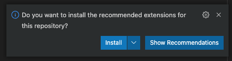

= Reporter

This project can be used to create a penetration test report based on findings and some extra report content. 
The findings and issue content are merged and inserted into a LaTeX template. This template is them compiled to PDF.

== Setup

Clone the project using `git clone --recurse-submodules`. Then install the project using `pip install -e .`.

=== Dependencies

Install basictex to have the necessary tools to compile LaTeX: `brew install --cask basictex`

In order to use the provided functionality for creating standard issues, the program https://github.com/junegunn/fzf[fzf] should be installed.

To use the provided tooling for editing, installing Visual Studio Code is recommended, but not required.

== Usage

=== Creating a new report

To create a new report, use the following command:

```
reporter init <report_name>
```

This will create a new directory with the name <report_name> with the LaTeX template "report.tex" and the directory "issues" with one example issue. This new project is created based on the `report_init` directory.

=== Adding report content

==== Issue

The report can be created by adding new issues to the issue directory. Each issue has it's own directory, with an arbitrary name. In the directory, the issue file should have a name that starts with "issue" or ends with ".issue". All other files in the directory are interpreted as evidence.

To aid in creating an issue the command `create-issue` is provided:

```
reporter create-issue --title "This is the title"
```

It is also possible to easily create an issue based on an issue from the standard issue library.

```
reporter create-standard-issue
```

This opens `fzf` with all the files in the standard issue library. There one issue can be selected. This issue is then copied to the `issues` directory.

==== Evidence

To aid in creating a new evidence, the command `create-evidence` is provided:

```
reporter create-evidence <location> <output-file>
```

This will create a new evidence with the given location (hostname) and store it in the given output file.

=== Compiling the report

The report can be compiled with the following command:

```
reporter generate
```

This creates the directory `.cache` with all the files necessary for compilation, compiles the report and copies the resulting PDF report to the current directory.

=== Tooling

Reports created with the `reporter init` command contain a `.vscode` directory with settings for Visual Studio Code. These settings suggest some plugins for LaTeX editing and compiling, textile support, spelling checking and code review tools. The following popup is shown when VS Code is started.



Installing the plugins is recommended. The LaTeX report can be compiled by clicking the green arrow when editing the `report.tex` file.

== How it works

The directory `templates/default/report` contains a LaTeX template with jinja tags. This LaTeX template contains no text, all text is loaded using jinja. For creating the jinja context, several sources of information are used:

1. Static content. This content is stored in the directory `templates/default/static_content` and contains all static strings and pieces of text.
2. Issues and evidences. The directory `issues` in a report contains all issues and evidences for the report. These issues are parsed and merged with the jinja context.
3. Dynamic content. Based on the loaded issues, some dynamic content is generated, such as summaries and counts.

The steps for compiling the report are as follows:

1. Create the `.cache` directory in which the report is built.
2. Symlink all files in the report directory to the `.cache` directory.
3. Template all the LaTeX files and store them in the `.cache` directory.
4. Copy the necessary supportive files. These files are stored in `necessary_files` and contain a Makefile used to build the project and some other necessary files.
5. Run Make in the `.cache` directory to build the report
6. Copy the report PDF file to the report directory.

=== Overriding LaTeX files

When symlinking files from the report directory to `.cache`, the symlinked filenames are remembered and will not be overwritten in later steps. This means that it is possible to override any of the generated files by copying it to the report directory and editing it. Keep in mind that this bypasses the templating, so any dynamic content will not be updated.

=== Dradis/Textile parsing

For Textile parsing of Dradis content https://gitlab.local.northwave.nl/janjaap.korpershoek/textile_parser[Textile-Parser ] is used. This library parses a Dradis file and returns a dictionary containing all fields. The markup in the fields, like bullets, footnotes, etc. is converted to LaTeX and is inserted directly in the resulting Dradis Issue.

=== The LaTeX template

The latex template is stored in the `templates/default/report/` folder. The heart of the template is the `report.cls` latex class file. This file contains all kinds of commands and macro's to simplify the syntax for creating a latex support. It defines the colors for different risk levels of risks. It also defines the title page format and uses variables to fill the variable content.

==== Custom templates

It is possible to extend or override the existing template by creating a new template in the `templates` folder. Any file in `templates/new_template/report` will override a file with the same name in `templates/default/report`.
The directory `static_images` can be created in a report. These images are copied to the `.cache` folder in any new reports.

In addition, it is possible to add a file for generating dynamic content. To do this, create a file named `dynamic_text.py` in the directory of the new template. This file should contain a content like the following:

----
from reporter.dynamic_text import Generator


class English(Generator):
    def __init__(self, content):
        self.content = content

    def generate(self):
        self.content['anything'] = "This dynamically created value"

generators = {
    "en": English,
}
----

It is also possible to extend the reporter class. For this, add a file named `reporter.py` in the directory of the new template. This file should contain a content like the following:

----
from reporter.reporter import Reporter as Base


class Reporter(Base):
    ...
    def process_issues(self, content, issues):
        """Do something with the content based on the issues"""
    ...
----

==== Notable commands/macro's

----
\companyname{Company B.V.}
----

Set the company name.

----
\assignment{CONTENT}
----

Describe the assignment, what did we do, etc.

----
\managementConclusion{CONTENT}
----

Describe the conclusion of the project to the management

===== Issue

For creating an issue, the `issue` environment is available. This environment is normally filled based on the Textile formatted issue and evidence files. The format is described below.

----
\begin{issue}
\descriptionfield{Thes issue is ... }
\solution{You should ... }
\location{Hostname.domain}
\cvss{0.0}
\cvssvector{CVSS3.1:AV/N...}

\begin{evidence}{Hostname}

Some text ...

\begin{code}
Verbatim code snippet
\end{code}

Some more text ...
\end{evidence}

\end{issue}
----

==== Colors

The following colors are available

|===
|Color    |Use
|critical |Critical risk
|high     |High risk
|medium   |Medium risk
|low      |Low risk
|none     |Informational risk
|codebg   |Background for code listings
|highlight|Highlighted code in listing
|===
